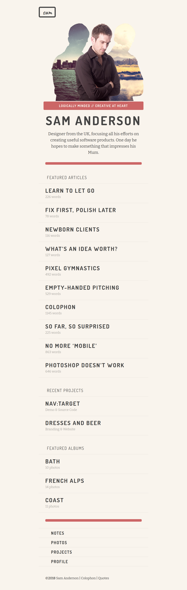

# Sam Anderson Portfolio Challenge

## Context
Sam Anderson has been working as a Graphic Designer in London for several years. He now plans to expand his work in and outside London by having a web presence that showcases his work. Sam has already designed the layout of his web page but needs help in scripting the markups and styles to realize the design.​

## Problem Statement
Sam had assigned this work to a local FrontEnd Developer, but the developer had some challenges and unfortunately could only produce the markup. Sam now needs help in styling the web page such that it gives a great user-experience to attract his customers.​

Style a web page available in `./index.html` to make it better readable and looks more attractive.​ **Sam wants his Portfolio to resemble the image given below.**

### Details
- There are 4 fonts which are widely used across the page and they can be found at following locations:
    - FontAwesome -  https://netdna.bootstrapcdn.com/font-awesome/3.2.1/css/font-awesome.css (icon-pencil, icon-user, icon-lightbulb, icon-camera-retro)
    - Caveat - https://fonts.google.com/specimen/Caveat
    - Dosis - https://fonts.google.com/specimen/Dosis
    - Bitter - https://fonts.google.com/specimen/Bitter
- Color Codes frequently used on the page
    - Light Gray - rgba(0,0,0,0.1)
    - Dark Gray - rgba(0,0,0,0.35)
    - [#c66](./c66.png)
    - [#F9F4ED](./f9f4ed.png) 
    - [#444](./444.png)
- Images used across the page
    - [City-Mountain-Sam](./city-sam-mountain.png)

## Instructions
1. Download and unzip the boilerplate code.
2. Run the command `npm install` to install the dependencies required for automated testing.
3. Open the boilerplate code in VSCode to develop the assignment solution.
4. Add required CSS code to style the web page created in the `index.html` file.
5. First, test the solution locally by running the command `npm run test`.
6. Refactor the solution to ensure all test cases are passing.
7. DO NOT MODIFY THE PROVIDED CODE, ELSE THIS MAY IMPACT THE TEST CODE EXECUTION.
8. Zip the solution code by selecting all the files and folders **excluding** the `node_modules` folder and give the name same as assignment name to the zipped file.
9. Upload the zipped solution for submission.
